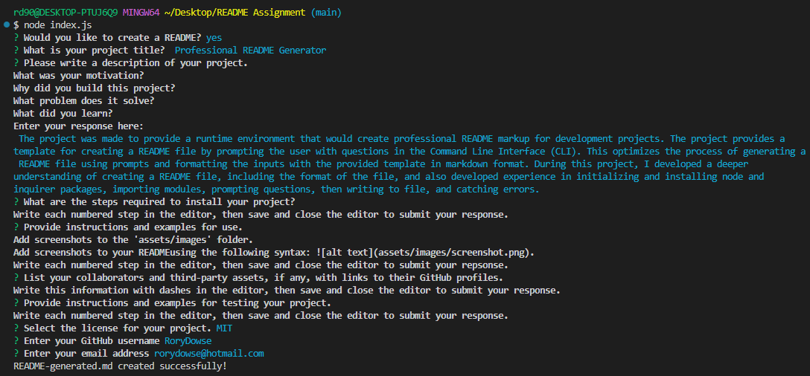
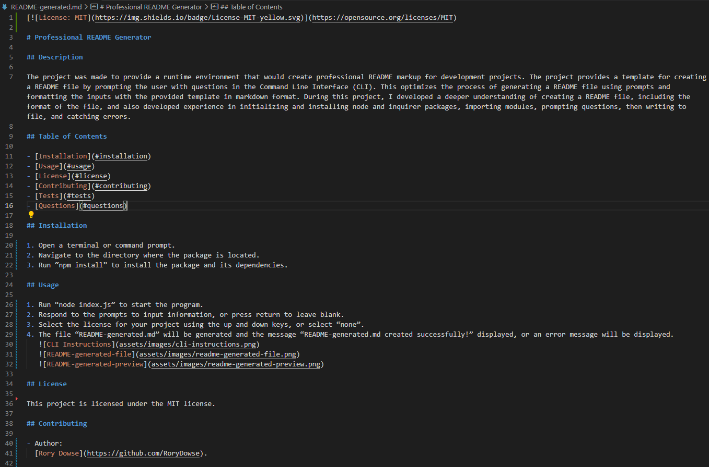

# Professional README Generator

## Description

The project was made to provide a runtime environment that would create professional README markup for development projects. The project provides a template for creating a README file by prompting the user with questions in the Command Line Interface (CLI). This optimizes the process of generating a README file using prompts and formatting the inputs with the provided template in markdown format. During this project, I developed a deeper understanding of creating a README file, including the format of the file, and also developed experience in initializing and installing node and inquirer packages, importing modules, prompting questions, then writing to file, and catching errors.

## Table of Contents

- [Installation](#installation)
- [Usage](#usage)
- [License](#license)
- [Contributing](#contributing)
- [Tests](#tests)
- [Questions](#questions)

## Installation

1. Open a terminal or command prompt.
2. Navigate to the directory where the package is located.
3. Run “npm install” to install the package and its dependencies.

## Usage

1. Run “node index.js” to start the program.
2. Respond to the prompts to input information, or press return to leave blank.
3. Select the license for your project using the up and down keys, or select “none”.
4. The file “README-generated.md” will be generated and the message “README-generated.md created successfully!” displayed, or an error message will be displayed.

   

   

## License

This project is licensed under the MIT license.

## Contributing

- Author:
  [Rory Dowse](https://github.com/RoryDowse).

- Third-party assets:
  [fs](https://nodejs.org/api/fs.html) - Node.js module for working with the file system; [inquirer](https://www.npmjs.com/package/inquirer) - Node.js module for collecting user input.

## Tests

1. Open the terminal or command prompt and navigate to the directory where your index.js file is located.
2. Run the command node.js to execute the file.
3. The application will prompt you with a series of questions. After answering all the questions, the application will generate a README file based on the provided input.
4. Open the generated README file, which is saved in the current directory with the name README-generated.md.
5. You can verify the functionality of the application by checking the generated README and ensuring that it contains the correct information entered by the user.

## Questions

Please visit my GitHub profile: https://github.com/RoryDowse. 
For additional questions, please contact me at: rorydowse@hotmail.com.
